# 点云匹配与识别

点云匹配与识别技术应用于3D重建，点云拼接，位姿估计，目标识别等场景中。一般来说，传统的点云匹配通过提取点云的局部描述符，寻找对应关系后进行位姿估计，而传统的点云识别通过点云聚类，提取各类点云的全局描述符，比较描述符距离实现。

该项目基于PCL库完成传统方法的点云匹配与识别，共实现8种局部描述符和6种全局描述符，并分析各个描述符的参数含义，在不同数据集中测试描述符精度与效果，**方便读者在不同场景的点云匹配与识别中快速调参，比较效果**。

**项目地址**：<https://github.com/sally-203/object_location>

## 一. 基本流程

点云匹配和识别的pipeline如图1所示 [<sup>1</sup>](#refer-anchor-1)
<figure>
  <div style="text-align:center;">
    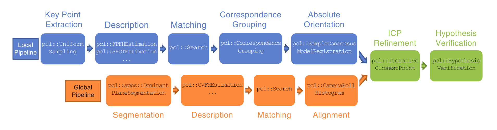
  </div>
  <figcaption><center>图1. 点云匹配与识别流程图</center></figcaption>
</figure>

- 点云匹配流程：关键点提取，局部描述符计算，匹配对应关系，位姿估计；
- 点云识别流程：点云分割聚类，全局描述符计算，匹配对应关系；

## 二. 基于局部描述符的点云匹配

### 2.1 关键点提取

在点云匹配过程中，我们往往不会对所有的点计算描述符，所以一般都选取一些关键点计算描述符，降低计算量。而好的关键点一般需要具备2个特性：

- 可重复性：即使从不同角度拍摄场景，该点仍然为选择到的关键点；
- 独特性：需要有极高的特征描述性，可以很容易匹配到；

该项目共实现2种关键点提取算法，分别为ISS关键点与降采样方法。

#### 2.1.1 ISS关键点提取

**原理：** 参考《Intrinsic shape signatures: A shape descriptor for 3D object recognition》[<sup>2</sup>](#refer-anchor-2)可知计算ISS的关键步骤如下：

- 选取点$p_{i}$，计算球状半径$r_{density}$邻域内每个点的权重$w_{i}=\frac{1}{\|{p_{j}:|p_{j}-p_{i}|<r_{density}}\|}$
- 计算$r_{frame}$邻域内，$p_{i}$带权重的协方差矩阵$cov(p_{i})$, $$COV(p_{i})=\sum_{|p_{j}-p_{i}|<r_{frame}}w_{j}(p_{j}-p_{i})(p_{j}-p_{i})^{T}/ \sum_{|p_{j}-p_{i}|<r_{frame}}w_{j}$$
- 计算矩阵特征值${\lambda_{i}^{1}, \lambda_{i}^{2}, \lambda_{i}^{3}}$，以上特征值按照顺序递减，对应的特征向量是$e_{i}^{1}, e_{i}^{2}, e_{i}^{3}$
- 如果$$\frac{\lambda_{i}^{2}}{\lambda_{i}^{1}}<\gamma_{21}, \frac{\lambda_{i}^{3}}{\lambda_{i}^{2}}<\gamma_{32}$$
且$\lambda_{i}^{1}>\lambda_{i}^{2}>\lambda_{i}^{3}$，那么$p_{i}$是关键点.

    $\lambda_{i}^{1}=\lambda_{i}^{2}>\lambda_{i}^{3}$: $p_{i}$是平面上的点

    $\lambda_{i}^{1}>\lambda_{i}^{2}=\lambda_{i}^{3}$: $p_{i}$是直线上的点
- 对$\lambda_{i}^{3}$做一次Non-Maximum Suppression

**核心代码&参数详解：**

```C++
void LocalMatcher::ExtractISSKeypoints(bool flag, const IssParameters& iss_param)
{
    PXYZS::Ptr keypoints(new PXYZS);
    PXYZS::Ptr cloud(new PXYZS);
    pcl::ISSKeypoint3D<PXYZ, PXYZ> detector;

    detector.setInputCloud(cloud);
    pcl::search::KdTree<PXYZ>::Ptr KdTree(new pcl::search::KdTree<PXYZ>);
    detector.setSearchMethod(KdTree);
    double resolution = ComputeCloudResolution(cloud);

    // Set the radius of the spherical neighborhood used to compute the scatter matrix.
    detector.setSalientRadius(iss_param.salient_radius * resolution);
    // Set the radius for the application of the non maxima supression algorithm.
    detector.setNonMaxRadius(iss_param.nonmax_radius * resolution);
    // Set the minimum number of neighbors that has to be found while applying the non maxima suppression algorithm.
    detector.setMinNeighbors(iss_param.min_neighbors);
    // Set the upper bound on the ratio between the second and the first eigenvalue.
    detector.setThreshold21(iss_param.threshold21);
    // Set the upper bound on the ratio between the third and the second eigenvalue.
    detector.setThreshold32(iss_param.threshold32);
    // Set the number of prpcessing threads to use. 0 sets it to automatic.
    detector.setNumberOfThreads(iss_param.num_threads);

    detector.compute(*keypoints);
}
```

首先考虑到点云的尺寸密度等参数，为了让参数更加鲁棒，需要先计算点云精度resolution。

- *salient_radius*是计算权重矩阵的点云半径$r_{frame}$；
- *nonmax_radius*是最后对选出来的关键点进行非极大值抑制选取的半径；
- *min_neighbors*是进行非极大值抑制方法所需要的最少的点;
- *Threshold21*是$\frac{\lambda_{i}^{2}}{\lambda_{i}^{1}}$;
- *Threshold32*是$\frac{\lambda_{i}^{3}}{\lambda_{i}^{2}}$;
- *num_threads*是运行线程数;

#### 2.1.2 降采样

降采样方法包括体素下采样，均匀下采样，曲率下采样，随机降采样方法[<sup>3</sup>](#refer-anchor-3)，该项目采样体素下采样方法。

### 2.2 局部描述符计算

#### 2.2.1 PFH (Point Feature Histogram) 原理

通过使用多维直方图概括点周围的平均曲率，对点的k邻域几何属性进行编码。下图表示查询点$p_{q}$以及其距离小于半径***pfh_radius***的k个邻域点的关系。

<figure>
  <div style="text-align:center;">
    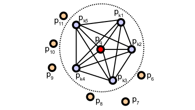
  </div>
  <figcaption><center>图2. PFH邻域关系</center></figcaption>
</figure>

计算两点$p_{i}$和$p_{j}$的法线$n_{i}$和$n_{j}$，并定义这两个点的局部参考坐标系LRF (Local Reference Frame)，如下图所示

<figure>
  <div style="text-align:center;">
    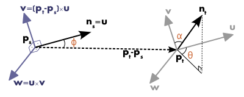
  </div>
  <figcaption><center>图3. LRF示意图</center></figcaption>
</figure>

将两点共12个特征（x,y,z,r,g,b）减少到4个特征表示<$\alpha$, $\phi$, $\theta$, d>，其中d为两点之间的欧式距离。同理计算邻域内所有两两结合的点对特征，形成直方图。

**核心代码&参数详解：**

```C++
void LocalMatcher::CalculatePfhDescri(
    const PXYZS::Ptr cloud,
    double pfh_radius, double normal_radius,
    const pcl::PointCloud<pcl::PFHSignature125>::Ptr& descriptors)
{
    pcl::PointCloud<PN>::Ptr normals(new pcl::PointCloud<PN>());
    pcl::search::KdTree<PXYZ>::Ptr kdtree(new pcl::search::KdTree<PXYZ>);

    EstimateNormalsByK(cloud, normals, 10);
    pcl::PFHEstimation<PXYZ, PN, pcl::PFHSignature125> pfh;
    pfh.setInputCloud(cloud);
    pfh.setInputNormals(normals);
    pfh.setSearchMethod(kdtree);
    pfh.setRadiusSearch(pfh_radius);

    pfh.compute(*descriptors);
}
```

这里计算描述符的主要参数是*pfh_radius*，主要影响的是图1邻域内的点数。*pfh_radius*越大，描述信息越全，但是计算量也越大。一般根据点云大小和实际场景确定*pfh_radius*。**值得注意的是**，local_parameters.h中的默认参数都是根据零件点云确定的，更换场景及点云，参数也需要调整。

#### 2.2.2 FPFH (Fast Point Feature Histogram) 原理

FPFH是在PH基础上改进的快速描述符，如下图所示，主要按照2步进行计算：

1.对于查询点$p_{q}$，计算其自身与k个邻域点之间的PFH描述符，记为简化的点特征直方图SPFH（红色直线表示）；

2.遍历每个邻域点，同样按照第1步计算SPFH；

3.对以上计算得到的SPFH进行加权计算:$$FPFH(p_{q})=SPFH(p_{q})+\frac{1}{k}\sum_{i=1}^{k}\frac{1}{w_{i}}\times SPFH(p_{i})$$

其中权重$w_{i}$表示查询点和邻域点之间的距离，在1，2步计算中可能个会有多遍描述符计算的过程，用加粗直线表示。

<figure>
  <div style="text-align:center;">
    
  </div>
  <figcaption><center>图4. FPFH示意图</center></figcaption>
</figure>

**核心代码&参数详解：**

```C++
void LocalMatcher::CalculateFpfhDescri(
    const PXYZS::Ptr cloud,
    double fpfh_radius,
    const pcl::PointCloud<pcl::FPFHSignature33>::Ptr& descriptors)
{
    pcl::PointCloud<pcl::Normal>::Ptr normals(new pcl::PointCloud<pcl::Normal>());
    pcl::search::KdTree<PXYZ>::Ptr kdtree(new pcl::search::KdTree<PXYZ>());

    EstimateNormalsByK(cloud, normals, 10);
    pcl::FPFHEstimation<PXYZ, PN, pcl::FPFHSignature33> fpfh;
    fpfh.setInputCloud(cloud);
    fpfh.setInputNormals(normals);
    fpfh.setSearchMethod(kdtree);
    fpfh.setRadiusSearch(fpfh_radius);
    fpfh.compute(*descriptors);
}
```

与PFH类似，这里计算描述符的主要参数是*fpfh_radius*，主要影响的是图3邻域内的点数。*fpfh_radius*越大，描述信息越全，但是计算量也越大。一般根据点云大小和实际场景确定*fpfh_radius*。

#### 2.2.3 RSD (Radius-based Surface Descriptor) 原理

迭代关键点集合：

1. 选择以$p_{i}$为中心，r为半径的球体内的所有相邻点，相邻点集合记为$p_{ik}$；
2. 迭代$p_{ik}$集合，计算$p_{i}$与当前邻域点之间的距离以及它们法线之间的角度$\alpha$。这些值组成$p_{i}$处曲率的直方图；
3. 可以通过两个点拟合具有近似半径$r_{c}$的圆，如果两点位于同一平面上时，则半径将变为无限大；
4. 由于查询点$p_{i}$可以是多个圆及其邻居的一部分，所以仅保留最小和最大的半径。该算法设置一个最大半径参数，超过该参数则被视为平面。

<figure>
  <div style="text-align:center;">
    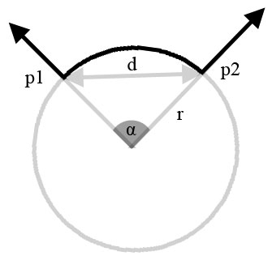
  </div>
  <figcaption><center>图5. RSD示意图</center></figcaption>
</figure>

**核心代码&参数详解：**

```C++
void LocalMatcher::CalculateRsdDescri(
    const PXYZS::Ptr cloud,
    double rsd_radius, double plane_radius,
    const pcl::PointCloud<pcl::PrincipalRadiiRSD>::Ptr& descriptors)
{
    pcl::PointCloud<pcl::Normal>::Ptr normals(new pcl::PointCloud<pcl::Normal>());
    pcl::search::KdTree<PXYZ>::Ptr kdtree(new pcl::search::KdTree<PXYZ>());

    EstimateNormalsByK(cloud, normals, 10);
    pcl::RSDEstimation<PXYZ, PN, pcl::PrincipalRadiiRSD> rsd;
    rsd.setInputCloud(cloud);
    rsd.setInputNormals(normals);
    rsd.setSearchMethod(kdtree);
    rsd.setRadiusSearch(rsd_radius);
    rsd.setPlaneRadius(plane_radius);
    rsd.setSaveHistograms(false);

    rsd.compute(*descriptors);
}
```

- *rsd_radius*是搜索半径r;
- *plane_radius*是平面半径，任何大于该参数的半径都被认为是无限大的平面；

#### 2.2.4 3DSC (3D Shape Context) 原理

如下图所示，3DSC是2DSC的扩展[<sup>4</sup>](#refer-anchor-4)。以基础点p为例，它的北极方向为法向量方向，建立以p为中心的支撑域，并在各个方位角划分等分的bins。按照半径分为J+1份，记半径集合${R = R_{0}, \cdots, R_{J}}$。按照俯仰角分为K+1份，记俯仰角集合$\theta=\theta_{0}, \cdots, \theta_{K}$。按照方位角分为L+1份，记方位角集合$\phi = \phi_{0},\cdots,\phi_{L}$。俯仰角和方位角方向都是按照对数计算划分格子的。

$$R_{0}=r_{min}, R_{J}=r_{max}, R_{j}=exp(ln(r_{min})+\frac{j}{J}ln(\frac{r_{max}}{r_{min}}))$$

对数采样使得描述符对于距离更加鲁棒。靠近中心的bin在所有三个维度上都较小，所以这些bin对微小差异很敏感，因此我们使用最小半径 ($r_{min}$ > 0) 参数，不计算小于R<$r_{min}$的bin。

$\theta$最大为180度，$\phi$最大为360度。另外，bin(j,k,l)对应权重计算公式如下：
$$w_{p_{i}}=\frac{1}{\rho_{i}\sqrt[3]{V(j,k,l)}}$$
$V(j,k,l)$是bin的体积，$\rho_{i}$是当前bin里面点的密度，所有bin构成3DSC描述符。

<figure>
  <div style="text-align:center;">
    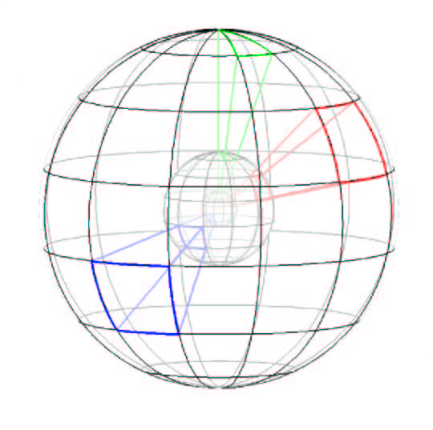
  </div>
  <figcaption><center>图6. 3DSC示意图</center></figcaption>
</figure>

**核心代码&参数详解：**

```C++
void LocalMatcher::CalculateDscDescri(
    const PXYZS::Ptr cloud,
    double dsc_radius, double minimal_radius,
    double point_density_raidus,
    const pcl::PointCloud<pcl::ShapeContext1980>::Ptr& descriptors)
{
    pcl::PointCloud<PN>::Ptr normals(new pcl::PointCloud<pcl::Normal>());
    pcl::search::KdTree<PXYZ>::Ptr kdtree(new pcl::search::KdTree<PXYZ>());

    EstimateNormalsByK(cloud, normals, 10);
    pcl::ShapeContext3DEstimation<PXYZ, PN, pcl::ShapeContext1980> sc3d;
    sc3d.setInputCloud(cloud);
    sc3d.setInputNormals(normals);
    sc3d.setSearchMethod(kdtree);
    sc3d.setRadiusSearch(dsc_radius);
    sc3d.setMinimalRadius(minimal_radius);
    sc3d.setPointDensityRadius(point_density_raidus);

    sc3d.compute(*descriptors);
}
```

- *dsc_radius*是支撑球体半径，也是搜索半径$R_{max}$；
- *minimal_radius*支撑球体的最小半径$r_{min}$，避免在靠近球体中心的bin对噪声过于敏感；
- *point_density_radius*是计算邻域的局部点密度半径，就是在这个半径内计算$\rho_{i}$。

#### 2.2.4 USC (Unique Shape Context) 原理

USC是在3DSC的基础上进行改进，USC研究者认为3DSC缺少可重复性的局部参考坐标系(Local Reference Frame)，因此他们提出建立一个LRF[<sup>5</sup>](#refer-anchor-5)。考虑当前特征点$p$，和半径R内的球状邻域，计算权重矩阵M
$$M=\frac{1}{Z}\sum_{i:d_{i}\le R}(R-d_{i})(p_{i}-p)(p_{i}-p)^{T}$$
其中，$d_{i}=\|p_{i}-p\|_{2}$，Z是归一化因子，$Z=\sum_{i:d_{i}\le R}(R-d_{i})$。接着对M进行特征向量分解，最小特征值对应的特征向量为当前坐标系的法向量方向。

**核心代码&参数详解：**

```C++
void LocalMatcher::CalculateUscDescri(
    const PXYZS::Ptr cloud,
    double usc_radius, double minimal_radius,
    double point_density_raidus, double local_radius,
    const pcl::PointCloud<pcl::UniqueShapeContext1960>::Ptr& descriptors)
{
    pcl::search::KdTree<PXYZ>::Ptr kdtree(new pcl::search::KdTree<PXYZ>());

    pcl::UniqueShapeContext<PXYZ, pcl::UniqueShapeContext1960, pcl::ReferenceFrame> usc;
    usc.setInputCloud(cloud);
    usc.setRadiusSearch(usc_radius);
    usc.setMinimalRadius(minimal_radius);
    usc.setPointDensityRadius(point_density_raidus);
    usc.setLocalRadius(local_radius);

    usc.compute(*descriptors);
}
```

因为是在3DSC基础上改进的，所以前三个参数都和3DSC一样

- *usc_radius*是支撑球体半径，也是搜索半径；
- *minimal_radius*是支撑球体的最小半径$r_{min}$，避免在靠近球体中心的bin对噪声过于敏感；
- *point_density_radius*是计算邻域的局部点密度半径，就是在这个半径内计算$\rho_{i}$;
- *local_radius*表示计算LRF的半径范围$R$。

#### 2.2.4 SHOT (Signature of Histograms of Orientations) 原理

SHOT是一种基于局部特征的描述子，在特征点处建立局部坐标系，将邻域点的空间位置信息和几何特征统计信息结合起来描述特征点。Tombari等人[<sup>6</sup>](#refer-anchor-6)将3D局部特征描述方法分为两类，即基于特征的描述方法与基于直方图的描述方法，并分析了两种方法的优势，提出基于特征的局部特征描述方法要比后者在特征的描述能力上更强，而基于直方图的局部特征描述方法在特征的鲁棒性上比前者更胜一筹。计算步骤如下：

1. 按照USC相同的原理，在特征点邻域半径R内建立参考坐标系LRF，对特征点的球邻域分别沿径向（内外球），经度（时区），和纬度（南北半球）方向进行区域划分。通常径向划分为2，经度划分为8，纬度划分为2，总共32个区域；
2. 计算LRF中的每个划分区间内的每一点和坐标系原点（特征点）的角度$\theta$的余弦值$cos\theta$，按其值保存在直方图中，这样初步得到了该特征点的直方图表达。每一个$cos\theta$可以划分11个区间（实验表示这个区间数量最好），所以总共有32*11个特征向量；
3. 因为描述符是基于局部直方图的，不可避免会受到边缘效应的影响，因此Tombari等人采用了四线性插值[<sup>7</sup>](#refer-anchor-7)方法。

<figure>
  <div style="text-align:center;">
    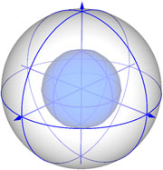
  </div>
  <figcaption><center>图7. SHOT示意图</center></figcaption>
</figure>

**核心代码&参数详解：**

```C++
void LocalMatcher::CalculateShotDescri(
    const PXYZS::Ptr cloud,
    double shot_radius,
    const pcl::PointCloud<pcl::SHOT352>::Ptr& descriptors)
{
    pcl::PointCloud<PN>::Ptr normals(new pcl::PointCloud<pcl::Normal>());
    pcl::search::KdTree<PXYZ>::Ptr kdtree(new pcl::search::KdTree<PXYZ>());

    EstimateNormalsByK(cloud, normals, 10);

    pcl::SHOTEstimation<PXYZ, PN, pcl::SHOT352> shot;
    shot.setInputCloud(cloud);
    shot.setInputNormals(normals);
    shot.setRadiusSearch(shot_radius);

    shot.compute(*descriptors);
}
```

- *shot_radius*是关键点邻域半径，搜索半径

#### 2.2.5 SI (Spin image) 原理

参考论文[<sup>8</sup>](#refer-anchor-8)，可知Spin Image是基于点云空间分布的最经典的特征描述方法，其思想是将一定区域的点云分布转换成二维的Spin Image，然后对场景和模型的Spin Image进行相似性度量。

参考博客[<sup>9</sup>](#refer-anchor-9)：
<figure>
  <div style="text-align:center;">
    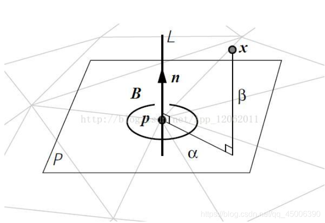
  </div>
  <figcaption><center>图8. SI特征点示意图</center></figcaption>
</figure>

- P：三维网格某顶点P的切面
- n：p点的单位法向量
- x：p附近的三维网格上的另一个顶点
- $\alpha$：x点在P上的投影与p的距离
- $\beta$：x点与P点的垂直距离
- $p$和$n$统一称为带法向的有向点

生成Spin Image的步骤如下所示：

1. 以有向点p的法向为轴生成一个圆柱坐标系；
2. 定义Spin Image参数，它是一个具有一定大小（行数列数），分辨率（二维网格大小）的二维图像；
3. 将圆柱体内的三维坐标投影到二维的Spin Image，这一过程可以理解为一个Spin Image绕着法向量n旋转360度，Spin Image扫到的三维空间的点会落到Spin Image的网格中：
$$S_{O}:R^{3}\longrightarrow R^{2}$$
$$S_{O}(x)\longrightarrow (\alpha,\beta)=(\sqrt{\|x-p\|^{2}-(n\cdot (x-p))^{2}},n\cdot (x-p))$$
4. 根据Spin Image中的每个网格中落入的点的不同，计算每个网格的强度I。为了降低对位置的敏感度和降低噪声，使用双线性插值将1个点分布到4个像素中。

<figure>
  <div style="text-align:center;">
    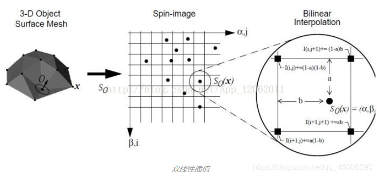
  </div>
  <figcaption><center>图9. 双线性插值示意图</center></figcaption>
</figure>

5. 一般使用以下公式进行相似性度量：

$$C(P,Q)=(atanh(R(P,Q)))^{2}-\lambda(\frac{1}{N-3})$$
其中
$$R(P,Q)=\frac{N\sum p_{i}q_{i}-\sum p_{i}\sum q_{i}}{\sqrt{(N\sum p_{i}^{2}-(\sum p_{i})^{2}(N\sum q_{i}^{2}-(\sum q_{i})^{2})}}$$
其中， N是每个Spin Image的像素数，atanh为反双曲正切函数，其输入的范围是[-1,1]，R的范围是[-1,1]，两个Spin Image越相似，R越接近于1，完全一样时R的值为1。

**核心代码&参数详解：**

```C++
void LocalMatcher::CalculateSiDescri(
    const PXYZS::Ptr cloud,
    double si_radius, int image_width,
    double normal_radius,
    const pcl::PointCloud<pcl::Histogram<153>>::Ptr& descriptors)
{
    pcl::PointCloud<PN>::Ptr normals(new pcl::PointCloud<PN>());
    pcl::search::KdTree<PXYZ>::Ptr kdtree(new pcl::search::KdTree<PXYZ>());
    EstimateNormalsByK(cloud, normals, 10);

    pcl::SpinImageEstimation<PXYZ, PN, pcl::Histogram<153>> si;
    si.setInputCloud(cloud);
    si.setInputNormals(normals);
    si.setRadiusSearch(si_radius);
    si.setImageWidth(image_width);

    si.compute(*descriptors);
}
```

- image_width是spin_image的分辨率，即一个维度的bins数量
- si_radius是关键点邻域半径，也就是搜索半径

#### 2.2.6 ROPS (Rotational Projection Statistics) 原理

ROPS是Yulan Guo等人[<sup>10</sup>](#refer-anchor-10)提出的一种通过计算位于局部表面上的所有点的散射矩阵来定义LRF的新技术。ROPS特征描述符是通过将特征点的邻近点旋转投影到2D平面上并计算这些投影点分布的统计数据获得的。局部曲面由给定支撑半径内的点和三角形组成，对于给定的局部表面，计算LRF(局部参考系)。

1. 绕当前轴，以给定角度旋转局部表面；
2. 组成旋转的局部表面的点投影到XY，XZ，YZ平面；
3. 建立投影分布矩阵，矩阵反映了每个bin中点的数量分布，bins数量表示矩阵维度；
4. 计算矩阵的中心矩和香农熵：M11，M12，M21，M22，E；
5. 这些值组成子特征；
6. 按照不同的旋转角度迭代重复步骤1-5，连接子特征构建最后的ROPS特征描述符。

**核心代码&参数详解：**

```C++
void LocalMatcher::CalculateRopsDescri(
    const PXYZS::Ptr cloud, double rops_radius,
    int num_partions_bins, int num_rotations,
    double support_radius, double normal_radius,
    const pcl::PointCloud<pcl::Histogram<135>>::Ptr& descriptors)
{
    pcl::PointCloud<PN>::Ptr normals(new pcl::PointCloud<PN>());
    pcl::search::KdTree<PXYZ>::Ptr kdtree(new pcl::search::KdTree<PXYZ>());
    pcl::PointCloud<pcl::PointNormal>::Ptr cloudNormals(
        new pcl::PointCloud<pcl::PointNormal>);

    EstimateNormalsByK(cloud, normals, 10);

    // perform triangulation
    pcl::concatenateFields(*cloud, *normals, *cloudNormals);
    pcl::search::KdTree<pcl::PointNormal>::Ptr kdtree2(
        new pcl::search::KdTree<pcl::PointNormal>);
    kdtree2->setInputCloud(cloudNormals);

    pcl::GreedyProjectionTriangulation<pcl::PointNormal> triangulation;
    pcl::PolygonMesh triangles;
    triangulation.setSearchRadius(0.1);
    triangulation.setMu(2.5);
    triangulation.setMaximumNearestNeighbors(10);
    triangulation.setMaximumSurfaceAngle(M_PI / 4);
    triangulation.setNormalConsistency(false);
    triangulation.setMinimumAngle(M_PI / 18);
    triangulation.setMaximumAngle(2 * M_PI / 3);
    triangulation.setInputCloud(cloudNormals);
    triangulation.setSearchMethod(kdtree2);
    triangulation.reconstruct(triangles);

    // rops estimation object
    pcl::ROPSEstimation<PXYZ, pcl::Histogram<135>> rops;
    rops.setInputCloud(cloud);
    rops.setSearchMethod(kdtree);
    rops.setRadiusSearch(rops_radius);
    rops.setTriangles(triangles.polygons);
    rops.setNumberOfPartitionBins(num_partions_bins);
    rops.setNumberOfRotations(num_rotations);
    rops.setSupportRadius(support_radius);

    rops.compute(*descriptors);
}
```

三角化算法是为了得到点云多边形，该项目使用GreedyProjectionTriangulation方法实现3D点云的三角剖分。

- SearchRadius: 搜索半径
- Mu: 设置最近邻距离的乘数以获得每个点的最终搜索半径（这将使算法适应不同的点云密度）
- MaximumNearestNeighbors: 设置搜索的最大数量的最近邻点
- MaximumSurfaceAngle: 如果点的法线与查询点法线的偏差超过此值，则不要考虑进行三角测量
- MinimumAngle: 每个三角形的最小角度
- MaximumAngle: 每个三角形的最大角度

三角化之后，进行rops描述符估计

- num_partions_bins: 允许设置用于分布矩阵计算的bins数量
- num_rotations: 旋转次数越多，得到的描述符就越大
- support_radius: 允许设置用于裁剪点的局部表面的支撑半径
- rops_radius: 邻域半径，也就是搜索半径

### 2.3 匹配对应关系

已经得到scene和model点云的描述符集合，接下来可以根据最近邻搜索得到两个点云对应匹配的描述符。

1. 首先，根据model点云描述符建立搜索树；
2. 接着，遍历scene点云描述符，在搜索树中寻找1个与它距离最接近的model描述符
3. 最后，记录找到的匹配描述符

**核心代码&&参数详解（以PFH举例）：**

```C++
pcl::KdTreeFLANN<pcl::PFHSignature125> matching;
matching.setInputCloud(model_descriptors);

pcl::CorrespondencesPtr correspondences(new pcl::Correspondences());

for (size_t i = 0; i < scene_descriptors->size(); ++i) {
    std::vector<int> neighbors(1);
    std::vector<float> squaredDistances(1);
    if (std::isfinite(scene_descriptors->at(i).histogram[0])) {
        int neighborCount = matching.nearestKSearch(scene_descriptors->at(i), 1,
            neighbors, squaredDistances);
        // std::cout << squaredDistances[0] << std::endl;
        if (neighborCount == 1 && squaredDistances[0] < pfh_param.distance_thre) {
            pcl::Correspondence correspondence(neighbors[0], static_cast<int>(i),
                squaredDistances[0]);
            correspondences->push_back(correspondence);
        }
    }
}
```

这边需要注意的是**distance_thre**，这是搜索的描述符距离阈值，不同的描述符，阈值不同，可以参考local_paramters.h

### 2.4 位姿估计

在标准RANSAC位姿估计循环中插入了一个简单但有效的“预拒绝”步骤，以避免验证可能错误的位姿假设。这是通过局部姿态不变的几何约束来实现的方法。

**核心代码&&参数详解（以PFH举例）： [<sup>11</sup>](#refer-anchor-10)**

```C++
pcl::SampleConsensusPrerejective<PXYZ, PXYZ, pcl::PFHSignature125> pose;
PXYZS::Ptr alignedModel(new PXYZS);

pose.setInputSource(model_keypoints_);
pose.setInputTarget(scene_keypoints_);
pose.setSourceFeatures(model_descriptors);
pose.setTargetFeatures(scene_descriptors);

pose.setCorrespondenceRandomness(pfh_param.common_params.randomness);
pose.setInlierFraction(pfh_param.common_params.inlier_fraction);
pose.setNumberOfSamples(pfh_param.common_params.num_samples);
pose.setSimilarityThreshold(pfh_param.common_params.similiar_thre);
pose.setMaxCorrespondenceDistance(pfh_param.common_params.corres_distance);
pose.setMaximumIterations(pfh_param.common_params.nr_iterations);

pose.align(*alignedModel);
if (pose.hasConverged()) {
    transformations_ = pose.getFinalTransformation();
    print();
} else {
    std::cout << "Did not converge." << std::endl;
}
```

- InputSource: 源点云关键点
- InputTatget: 目标点云关键点
- SourceFeatures: 源点云描述符
- TargetFeatures: 目标点云描述符
- CorrespondenceRandomness: 随机度。构造对应点对时，并非直接选择特征匹配距离最小的，而是在若干个最佳匹配点之间进行随机选择，这样虽然增加了迭代次数，但使得该算法对包含离群点的数据具有更好的鲁棒性（default=3）
- InlierFraction: 内点数量占比。在许多实际应用中，观察到的目标对象的大部分在其所在场景中都是不可见的。在这种情况下，对于场景中我们不需要点云数据中的所有点都配准，只要内点数目占所有点云数目的占比较高，则该变换假设就是有效的（default=0.01）
- NumberOfSamples: 采样数目。在目标物体和场景之间，对应点对的样本数目，为了正常位姿估计至少需要3个点（default=3）
- SimilarityThreshold: 相似性阈值。这个值越接近1，该算法通过减少迭代次数而变得更快速。但是，当噪声存在时，也增加了排除正确位置的风险（default=0.4）
- MaxCorrespondenceDistance: 内点阈值。源点云与目标点云的最近点距离小于阈值，则认为该对应点对为内点（default=1.0）
- MaximumIterations: 最大迭代次数。(default=20000)

## 三. 基于全局描述符的点云识别

### 3.1 点云分割聚类

分割聚类方法需要将点云P划分到更小的部分，减少整体的处理时间。欧几里得意义上的简单数据聚类方法可以通过使用固定宽度框或更一般地八叉树数据结构来利用空间的3D网格细分来实现。

1. 为输入点云数据集P创建Kd-tree表示
2. 建立聚类的空列表C和需要核对的点队列Q
3. 遍历$p_{i}\in P$，执行以下步骤：

- 给当前的队列Q增加$p_{i}$
- 针对每个点$p_{i}\in Q$，搜索$r<d_{th}$的邻域点组成集合$P_{i}^{k}$，并判断该邻域点是否已经被处理，如果没有就加入Q
- 当Q中的所有点都被处理过了，增加Q到C中，并且重设Q为一个空列表

4. 当$p_{i}\in P$都被处理过之后，算法终止

**核心代码&&参数详解：**

```C++
void GlobalMatcher::ClusterPointCloud(const bool flag, const PXYZS::Ptr cloud,
    const ClusterParameters& cluster_param)
{
    pcl::search::KdTree<PXYZ>::Ptr kdtree(new pcl::search::KdTree<PXYZ>);
    kdtree->setInputCloud(cloud);

    pcl::EuclideanClusterExtraction<PXYZ> ec;
    ec.setClusterTolerance(cluster_param.cluster_tolerance);
    ec.setMinClusterSize(cluster_param.min_cluster_size);
    ec.setMaxClusterSize(cluster_param.max_cluster_size);
    ec.setSearchMethod(kdtree);
    ec.setInputCloud(cloud);

    std::vector<pcl::PointIndices> cluster_indices;
    ec.extract(cluster_indices);

    for (const auto& indices : cluster_indices) {
        PXYZS::Ptr cluster(new PXYZS);
        for (const auto& index : indices.indices) {
            cluster->points.push_back(cloud->points[index]);
        }
        cluster->width = cluster->points.size();
        cluster->height = 1;
        cluster->is_dense = true;
        if (flag) {
            scene_clusters_.push_back(cluster);
        } else {
            model_clusters_.push_back(cluster);
        }
    }
    if (flag) {
        std::cout << "scene cluster size: " << scene_clusters_.size() << std::endl;
        if (cluster_param.show_flag) {
            VisualizeClusters(scene_clusters_);
        }
    } else {
        std::cout << "model cluster size: " << model_clusters_.size() << std::endl;
        if (cluster_param.show_flag) {
            VisualizeClusters(model_clusters_);
        }
    }
}
```

- ClusterTolerance: 聚类容差。如果取一个非常小的值，则可能会发生一个实际对象可以被视为多个簇的情况。另一方面，如果将该值设置得太高，则可能会发生多个对象被视为一个簇的情况。 因此，需要测试并尝试哪个值适合对应的数据集。
- MinClusterSize: 最小的聚类size。
- MaxClusterSize: 最大的聚类size。

### 3.2 全局描述符计算

全局描述符不是针对单个点计算的，而是针对代表对象的整个簇计算的，因此需要预处理步骤（cluster）。全局描述符用于对象识别，分类和几何分析。许多局部描述符也可以作为全局描述符，这可以通过将半径设置为任意两点之间的最大可能距离（因此簇中的所有点被视为邻居）来实现。

#### 3.2.1 VFH(Viewpoint Feature Histogram)原理

视点特征直方图VFH是在FPFH的基础上，保持尺度不变性的同时添加视点方差，扩展到对整个对象簇的FPFH估计，并计算视点方向和每个点估计的法线之间的附加统计数据。

VFH是由两部分组成：视点方向分量和扩展FPFH分量。

1. 计算视点方向分量：首先，需要找到对象的质心，该质心是对所有点的X，Y，Z坐标进行平均而得到的点；然后，计算视点（传感器位置）和该质心之间的矢量并进行归一化；最后，对于簇中的所有点，计算该向量与其法线之间的角度，并将结果合并到直方图中。在计算角度时，矢量会平移到每个点。

<figure>
  <div style="text-align:center;">
    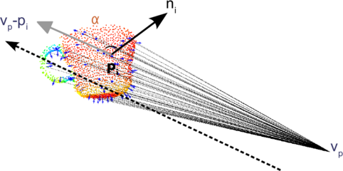
  </div>
  <figcaption><center>图10. 视点方向分量</center></figcaption>
</figure>

2. 计算扩展FPFH分量：类似于FPFH计算，唯一的区别时，它仅针对质心计算，使用计算的视点方向向量作为其法线，并将所有簇的点设置为邻域点。

<figure>
  <div style="text-align:center;">
    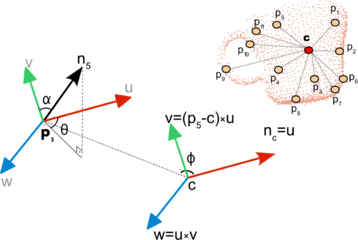
  </div>
  <figcaption><center>图11. 扩展FPFH分量</center></figcaption>
</figure>

3. 将生成的4个直方图（1个用于视点分量，3个用于扩展的FPFH分量）连接起来以构建最终的VFH描述符。默认情况下，bins使用簇中的总点数进行标准化，这使得VFH描述符不随比例变化。

<figure>
  <div style="text-align:center;">
    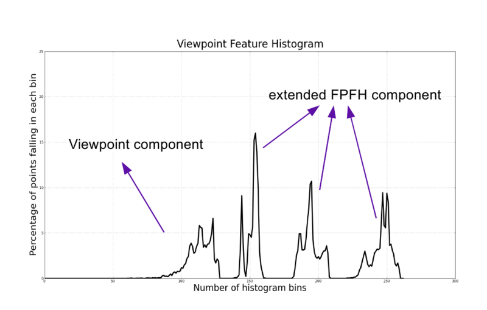
  </div>
  <figcaption><center>图12. VFH直方图拼接</center></figcaption>
</figure>

*PCL实现的VFH计算增加了第5个直方图，包含簇点到质心的距离（SDC, 可以参考CVFH)*

**核心代码&&参数详解：**

```C++
void GlobalMatcher::CalculateVfhDescri(
    const PXYZS::Ptr cloud,
    pcl::PointCloud<pcl::VFHSignature308>::Ptr descriptors)
{
    pcl::PointCloud<pcl::Normal>::Ptr normals(new pcl::PointCloud<PN>());
    pcl::search::KdTree<PXYZ>::Ptr kdtree(new pcl::search::KdTree<PXYZ>());
    EstimateNormalsByK(cloud, normals, 10);

    pcl::VFHEstimation<PXYZ, PN, pcl::VFHSignature308> vfh;
    vfh.setInputCloud(cloud);
    vfh.setInputNormals(normals);
    vfh.setSearchMethod(kdtree);
    vfh.setNormalizeBins(true);
    vfh.setNormalizeDistance(false);

    vfh.compute(*descriptors);
}
```

- NormalizeBins: 使用总点数对结果直方图的bins进行归一化
- NormalizeDistance: 使用质心和任何簇点之间找到的最大尺寸来标准化SDC

#### 3.2.2 CVFH(Clustered Viewpoint Feature Histogram)原理

VFH描述符对于遮挡，其他传感器伪影和测量误差并不稳健。如果对象簇丢失了许多点，则计算出的质心将与原始质心不同，从而改变最终描述符，不能找到正确的匹配。因此，引入聚类视点特征直方图CVFH。

相比于VFH计算整个簇的单个VFH直方图，CVFH首先使用**区域生长分割**将对象划分为稳定，平滑的区域，然后在每个区域都计算VFH描述符。
此外，CVFH还会计算形状分布分量(SDC)，这对有关区域质心周围的点分布的信息进行编码，并测量距离。SDC可以区分具有相似特征（大小和正态分布）的对象，例如彼此的两个平面。CVFH相对相机滚动角度是不变的，围绕该相机轴的旋转不会改变计算描述符。

<figure>
  <div style="text-align:center;">
    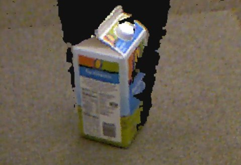
  </div>
  <figcaption><center>图13. 原始点云</center></figcaption>
</figure>

<figure>
  <div style="text-align:center;">
    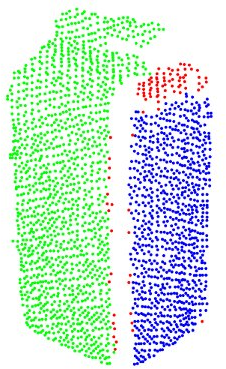
  </div>
  <figcaption><center>图14. 分割点云</center></figcaption>
</figure>

**核心代码&&参数详解：**

```C++
void GlobalMatcher::CalculateCvfhDescri(
    const PXYZS::Ptr cloud,
    double eps_angle, double curv_thre,
    const pcl::PointCloud<pcl::VFHSignature308>::Ptr descriptors)
{
    pcl::PointCloud<pcl::Normal>::Ptr normals(new pcl::PointCloud<PN>());
    pcl::search::KdTree<PXYZ>::Ptr kdtree(new pcl::search::KdTree<PXYZ>());
    EstimateNormalsByK(cloud, normals, 10);

    pcl::CVFHEstimation<PXYZ, PN, pcl::VFHSignature308> cvfh;
    cvfh.setInputCloud(cloud);
    cvfh.setInputNormals(normals);
    cvfh.setEPSAngleThreshold(eps_angle);
    cvfh.setCurvatureThreshold(curv_thre);
    cvfh.setNormalizeBins(false);

    cvfh.compute(*descriptors);
}
```

- EPSAngleThreshold: 在区域分割步骤中法线的最大允许偏差
- CurvatureThreshold: 区域分割步骤的曲率阈值（曲率之间的最大差异）
- NormalizeBins: 是否使用所有点对结果直方图进行归一化，Note: 如果设置为true，则CVFH是尺度不变的。

#### 3.2.3 OUR-CVFH(The Oriented, Unique and Repeatable CVFH)原理

OUR-CVFH扩展了之前的描述符，添加了唯一参考系的计算以使其更加鲁棒。

OUR-CVFH依赖半全局唯一参考系(Semi-Global Unique Reference Frames, SGURF)的使用，是为每个区域计算的可重复坐标系。它们不仅消除了相机胶卷的不变性并允许直接提取6DOF位姿而不需要额外的步骤，而且还提高了空间描述性。

**核心代码&&参数详解：**

```C++
void GlobalMatcher::CalculateOurcvfhDescri(
    const PXYZS::Ptr cloud,
    double eps_angle, double curv_thre, double axis_ratio,
    const pcl::PointCloud<pcl::VFHSignature308>::Ptr descriptions)
{
    pcl::PointCloud<pcl::Normal>::Ptr normals(new pcl::PointCloud<PN>());
    pcl::search::KdTree<PXYZ>::Ptr kdtree(new pcl::search::KdTree<PXYZ>());
    EstimateNormalsByK(cloud, normals, 10);

    pcl::OURCVFHEstimation<PXYZ, PN, pcl::VFHSignature308> ourcvfh;
    ourcvfh.setInputCloud(cloud);
    ourcvfh.setInputNormals(normals);
    ourcvfh.setSearchMethod(kdtree);
    ourcvfh.setEPSAngleThreshold(eps_angle);
    ourcvfh.setCurvatureThreshold(curv_thre);
    ourcvfh.setNormalizeBins(false);
    ourcvfh.setAxisRatio(axis_ratio);

    ourcvfh.compute(*descriptions);
}
```

- EPSAngleThreshold，CurvatureThreshold和NormalizeBins参数与CVFH算法中的参数一样
- AxisRatio: 设置SGURF轴之间的最小轴比率。

#### 3.2.4 ESF(Ensemble of Shape Functions)原理

形状函数集合（ESF）是3个不同形状函数的组合，描述点云的某些属性：距离，角度和面积。这些对噪声和不完整表面具有鲁棒性。该算法迭代点云中的所有点，每次迭代都会随机选择3个点，对于这些点，计算形状函数：

- D2：计算3个点对之间的距离。针对每一个点对，检查连接两个点的线是否完全位于曲面内部，完全位于曲面外部或穿过曲面。分别合并到三类直方图中：IN，OUT或MIXED；
- D2比率： 曲面内部线条部分与外部线条部分之间比率的直方图。如果线完全位于外部，则该值为0；如果完全位于内部，则该值为1；如果混合，则为中间的某个值；
- D3：计算3个点形成的三角形面积的平方根。与D2一样，结果也分为IN，OUT，或MIXED三个类别的直方图；
- A3：计算点形成的角度。然后，根据与D2比率相反的方式对该值建立直方图。

循环结束后，一共计算了10个子直方图（D2，D3，A3每个都有3个直方图，以及D2比率的直方图，一共有10个），每个直方图有64bins，因此最终ESF描述符大小为640.
<figure>
  <div style="text-align:center;">
    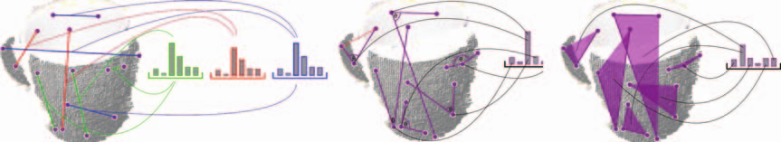
  </div>
  <figcaption><center>图15. ESF描述符</center></figcaption>
</figure>

**核心代码&&参数详解：**

```C++
void GlobalMatcher::CalculateEsfDescri(
    const PXYZS::Ptr cloud,
    pcl::PointCloud<pcl::ESFSignature640>::Ptr descriptions)
{
    pcl::PointCloud<pcl::Normal>::Ptr normals(new pcl::PointCloud<PN>());
    pcl::search::KdTree<PXYZ>::Ptr kdtree(new pcl::search::KdTree<PXYZ>());
    EstimateNormalsByK(cloud, normals, 10);

    pcl::ESFEstimation<PXYZ, pcl::ESFSignature640> esf;
    esf.setInputCloud(cloud);
    esf.compute(*descriptions);
}
```

#### 3.2.5 GFPFH(Global Fast Point Feature Histogram)原理

GFPFH表示全局FPFH描述符，设计目的是机器人的环境导航。

1. 表面分类。创建一组物体类别，假如一个咖啡杯，它可以有三个类别：手柄，杯子外表面，杯子内表面。
2. 计算FPFH描述符，并和类别一起输入CRF（条件随机场）算法。它可以标记每个表面，其中每个点都根据其所属的对象的类型进行分类。
3. 计算GFPFH描述符。设置八叉数，保存每个点属于某个类别的概率，将所有点的概率组成直方图。

**核心代码&&参数分析：**

```C++
void GlobalMatcher::GFPFHMatch(const GfpfhParameters& gfpfh_params)
{
  // label the point cloud
  pcl::PointCloud<pcl::GFPFHSignature16>::Ptr model_descriptors(new pcl::PointCloud<pcl::GFPFHSignature16>);
      for (int i = 0; i < model_clusters_.size(); ++i) {
          auto cluster = model_clusters_[i];
          pcl::PointCloud<pcl::PointXYZL>::Ptr object(new pcl::PointCloud<pcl::PointXYZL>());
          for (int j = 0; j < cluster->points.size(); ++j) {
              pcl::PointXYZL point;
              point.x = cluster->points[j].x;
              point.y = cluster->points[j].y;
              point.z = cluster->points[j].z;
              // point.label = 1 + j % scene_clusters_.size();
              point.label = 1 + i % model_clusters_.size();
              object->push_back(point);
          }
      }
      .......
}3.2.5 GFPFH(Global Fast Point Feature Histogram)原理3.2.5 GFPFH(Global Fast Point Feature Histogram)原理

void GlobalMatcher::CalculateGfpfhDescri(const pcl::PointCloud<pcl::PointXYZL>::Ptr cloud,
    double octree_leaf_size, double num_classes,
    const pcl::PointCloud<pcl::GFPFHSignature16>::Ptr descriptions)
{
    pcl::GFPFHEstimation<pcl::PointXYZL, pcl::PointXYZL, pcl::GFPFHSignature16> gfpfh;
    gfpfh.setInputCloud(cloud);
    gfpfh.setInputLabels(cloud);
    gfpfh.setOctreeLeafSize(octree_leaf_size);
    gfpfh.setNumberOfClasses(num_classes);

    gfpfh.compute(*descriptions);
}
```

- octree_leaf_size: 八叉数叶子的大小
- num_classes: 类别数量

#### 3.2.6 GRSD(Global Radius-based Surface Descriptor)原理

GRSD表示全局的RSD描述符。与GFPFH类似，预先执行体素化和表面分类步骤，使用RSD根据几何类别标记所有表面块。然后，将整个物体进行分类，并据此计算GRSD描述符。

**核心代码&&参数分析：**

```C++
void GlobalMatcher::CalculateGrsdDescri(
    const PXYZS::Ptr cloud,
    double grsd_radius,
    const pcl::PointCloud<pcl::GRSDSignature21>::Ptr descriptors)
{
    pcl::PointCloud<pcl::Normal>::Ptr normals(new pcl::PointCloud<PN>());
    pcl::search::KdTree<PXYZ>::Ptr kdtree(new pcl::search::KdTree<PXYZ>());
    EstimateNormalsByK(cloud, normals, 10);

    pcl::GRSDEstimation<PXYZ, PN, pcl::GRSDSignature21> grsd;
    grsd.setInputCloud(cloud);
    grsd.setInputNormals(normals);
    grsd.setSearchMethod(kdtree);
    grsd.setRadiusSearch(grsd_radius);

    grsd.compute(*descriptors);
}
```

- grsd_radius: 搜索半径，邻域半径。

### 3.3 匹配对应关系

已经得到model和scene的聚类点云，针对所有的聚类点云，计算对应的描述符。然后按照和局部描述符的匹配流程一样，在kdtree中搜索最近邻对应识别对，构成识别到的点云聚类correspondence，并显示识别结果。

**核心代码&&参数分析（以VFH为例）：**

```C++
void GlobalMatcher::VFHMatch(const VfhParameters& vfh_params)
{
    pcl::PointCloud<pcl::VFHSignature308>::Ptr model_descriptors(
        new pcl::PointCloud<pcl::VFHSignature308>());
    for (const auto cluster : model_clusters_) {
        pcl::PointCloud<pcl::VFHSignature308>::Ptr descriptors(
            new pcl::PointCloud<pcl::VFHSignature308>());
        CalculateVfhDescri(cluster, descriptors);
        if (descriptors->size() == 1) {
            model_descriptors->push_back(descriptors->at(0));
        } else {
            std::cout << "The VFH size in cluster cloud is not 1" << std::endl;
            return;
        }
    }

    pcl::PointCloud<pcl::VFHSignature308>::Ptr scene_descriptors(
        new pcl::PointCloud<pcl::VFHSignature308>());
    for (const auto cluster : scene_clusters_) {
        pcl::PointCloud<pcl::VFHSignature308>::Ptr descriptors(
            new pcl::PointCloud<pcl::VFHSignature308>());
        CalculateVfhDescri(cluster, descriptors);
        if (descriptors->size() == 1) {
            scene_descriptors->push_back(descriptors->at(0));
        } else {
            std::cout << "The VFH size in cluster cloud is not 1" << std::endl;
            return;
        }
    }

    pcl::KdTreeFLANN<pcl::VFHSignature308> kdtree;
    kdtree.setInputCloud(scene_descriptors);
    pcl::CorrespondencesPtr correspondences(new pcl::Correspondences());

    for (size_t i = 0; i < model_descriptors->size(); ++i) {
        std::vector<int> neighbors(1);
        std::vector<float> squaredDistances(1);

        int neighborCount = kdtree.nearestKSearch(model_descriptors->at(i), 1,
            neighbors, squaredDistances);

        if (neighborCount == 1) {
            pcl::Correspondence correspondence(
                neighbors[0], static_cast<int>(i),
                squaredDistances[0]); // [scene_index, model_index, distance]
            correspondences->push_back(correspondence);
        }
    }

    correspondences_ = correspondences;
    CorrespondenceViewer(vfh_params.show_flag);

    return;
}
```

## 四. 实验测试与评估

根据局部描述符和全局描述符，分别测试局部匹配的速度与精度，全局识别的速度与精度。

### 4.1 数据集和实验平台

- 数据集：
  点云匹配数据主要由工艺零件和Standford数据集组成。工艺零件数据集是mechmind相机真实拍摄的数据通过去除桌面得到的; Standford数据集包含真实变换位姿数据，生成方式是对Bunny/Duck/Hand等模型点云在各个方向进行投影变换，得到的变换数据。点云size如下表所示：

<center>

#### 表1. 不同数据集的点云数量

| Datasets |point size of scene|point size of model|
|--------|-------- |--------|
| 工艺零件 | 848    | 10000  |
| Bunny  | 3539    | 817    |
| Duck   | 5671    | 745    |  
| Hand   | 2499    | 1633   |

</center>

- 实验平台：

  -- 操作系统： 基于ubuntu 20.04系统

  -- CPU： 第11代英特尔酷睿i9-11950H，基本时钟频率为2.6GHz, 8核, 16线程

  -- RAM： 64001MB

  -- GPU： NVIDIA T1200

### 4.2 基于局部描述符的点云匹配
  
  下面计算基于局部描述符的不同数据集的点云匹配时间和匹配效果。

#### 4.2.1 匹配时间

分别计算不同匹配方法在不同数据集上的匹配时间，测量单位为毫秒。

- 数据集1：零件数据集
- 数据集2：Bunny
- 数据集3：Duck
- 数据集4：Hand

<center>

#### 表2. 不同描述符在不同数据集的匹配时间

| Descriptors / Datasets |    1    |    2   |   3    |   4   |
|--------                |-------- |--------|--------|-------|
| PFH                    | 1061    | 15587  |  27858 |  3953 |
| FPFH                   | 1061    | 4061   |  7228  |  9752 |
| RSD                    | 971     | 17268  |  5837  |  5364 |
| 3DSC                   | 780     | 8204   |  10850 |  30842|
| USC                    | 1011    | 24404  |  35527 |  43352|
| SHOT                   | 712     | 10504  |  6817  |  58375|
| Spin Image             | 660     | 5728   |  1237  |  49032|
| RoPS                   | 1044    | 2164   |  5197  |  12478|

</center>

#### 4.2.2 精度

不同数据的匹配效果如下图所示（这是经过调参之后的匹配效果）：

<figure>
  <div style="text-align:center;">
    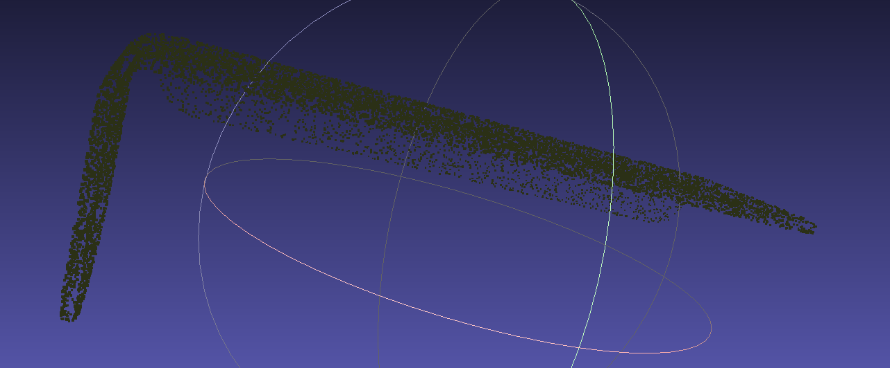
  </div>
  <figcaption><center> 图16. 不同方法在不同数据的匹配效果 </center></figcaption>
</figure>

评定精度方法有2种。第1种是对匹配后的点云alignedModel与场景点云sceneModel计算RMSE，方法参考AccuracyEstimate()。

<center>

#### 表3. 不同描述符在不同数据集匹配的RMSE

| Descriptors / Datasets |    1   |    2   |   3   |   4   |
|--------                |--------|--------|-------|-------|
| PFH                    | 0.013  | 0.091  | 0.122 | 0.038 |
| FPFH                   | 0.014  | 0.126  | 0.105 | 0.049 |
| RSD                    | 0.014  | 0.104  | 0.125 | 0.040 |
| 3DSC                   | 0.013  | 0.093  | 0.143 | 0.050 |
| USC                    | 0.014  | 0.108  | 0.122 | 0.044 |
| SHOT                   | 0.013  | 0.099  | 0.128 | 0.058 |
| Spin Image             | 0.013  | 0.103  | 0.147 | 0.051 |
| RoPS                   | 0.013  | 0.118  | 0.162 | 0.045 |

</center>

第2种是与已有的真值位姿比较，计算匹配后的位姿与真值的平移误差(m)和旋转误差(degree)，方法参考AbsolueAccuracyEstimate(Eigen::Matrix4f& true_pose)。

- x方向平移误差：

<center>

#### 表4. 不同描述符在不同数据集x方向的平移误差

| Descriptors / Datasets |    2   |    3   |    4   |
|--------                |--------|--------|--------|
| PFH                    | 0.666  | 0.014  |  0.002 |
| FPFH                   | 0.016  | 0.033  |  0.499 |
| RSD                    | 0.649  | 0.337  |  0.124 |
| 3DSC                   | 0.226  | 0.045  |  0.060 |
| USC                    | 0.067  | 0.019  |  0.108 |
| SHOT                   | 0.101  | 0.704  |  0.102 |
| Spin Image             | 0.530  | 0.169  |  0.168 |
| RoPS                   | 0.060  | 0.002  |  0.093 |

</center>

- y方向平移误差：

<center>

#### 表5. 不同描述符在不同数据集y方向的平移误差

| Descriptors / Datasets |    2   |    3   |    4   |
|--------                |--------|--------|--------|
| PFH                    | 0.887  | 0.039  |  0.025 |
| FPFH                   | 0.289  | 0.319  |  0.918 |
| RSD                    | 0.947  | 0.081  |  0.072 |
| 3DSC                   | 0.035  | 1.186  |  0.127 |
| USC                    | 0.166  | 0.009  |  0.026 |
| SHOT                   | 0.274  | 0.952  |  0.043 |
| Spin Image             | 0.911  | 0.145  |  0.089 |
| RoPS                   | 0.194  | 0.010  |  0.106 |

</center>

- z方向平移误差：

<center>

#### 表6. 不同描述符在不同数据集z方向的平移误差

| Descriptors / Datasets |    2   |    3   |    4   |
|--------                |--------|--------|--------|
| PFH                    | 0.911  | 0.076  |  0.039 |
| FPFH                   | 0.439  | 0.116  |  1.084 |
| RSD                    | 0.856  | 0.476  |  0.012 |
| 3DSC                   | 0.314  | 1.292  |  0.129 |
| USC                    | 0.274  | 0.059  |  0.045 |
| SHOT                   | 0.481  | 0.257  |  0.180 |
| Spin Image             | 1.096  | 0.092  |  0.137 |
| RoPS                   | 0.386  | 0.107  |  0.142 |

</center>

- roll 旋转误差：

<center>

#### 表7. 不同描述符在不同数据集roll的旋转误差

| Descriptors / Datasets |    2   |   3    |    4   |
|--------                |--------|--------|--------|
| PFH                    | -9.476 | -7.845 | -6.535 |
| FPFH                   | -15.759| 41.659 | 1.180  |
| RSD                    | -9.426 | 61.375 | -2.39  |
| 3DSC                   | -2.598 | -12.51 | -7.379 |
| USC                    | -15.628| 4.119  | 0.941  |
| SHOT                   | -15.025| -8.422 | -3.505 |
| Spin Image             | -13.303| -1.718 | -3.512 |
| RoPS                   | -9.636 | -8.223 | -2.9   |

</center>

- pitch 旋转误差：

<center>

#### 表8. 不同描述符在不同数据集pitch的旋转误差

| Descriptors / Datasets |    2   |   3    |    4   |
|--------                |--------|--------|--------|
| PFH                    | -52.622| -66.492| -67.586|
| FPFH                   | -42.251| 26.163 | -15.728|
| RSD                    | -58.121| -17.174| -60.225|
| 3DSC                   | -34.105| 4.550  | -66.059|
| USC                    | -64.506| 7.493  | 7.302  |
| SHOT                   | -31.512| -41.799| -45.586|
| Spin Image             | -38.823| -55.561| -67.253|
| RoPS                   | -38.322| -68.185| -51.058|

</center>

- yaw 旋转误差：

<center>

#### 表9. 不同描述符在不同数据集yaw的旋转误差

| Descriptors / Datasets |    2   |   3    |    4   |
|--------                |--------|--------|--------|
| PFH                    | 24.7882| 8.39   | 6.459  |
| FPFH                   | -17.603| 30.110 | 5.166  |
| RSD                    | 16.609 | 83.352 | 7.613  |
| 3DSC                   | -5.39  | 7.849  | -2.212 |
| USC                    | -4.666 | 5.090  | 3.564  |
| SHOT                   | -19.502| 9.000  | -10.936|
| Spin Image             | 25.140 | 14.671 | -13.962|
| RoPS                   | -18.824| 5.308  | -5.366 |

</center>

### 4.3 基于全局描述符的点云识别
  
  计算基于全局描述符的不同数据集的点云识别时间和识别效果。

#### 4.3.1 速度

  分别计算不同识别方法在不同数据集上的识别时间，测量单位为毫秒。

<center>

#### 表10. 不同描述符在不同数据集的识别时间

| Descriptors / Datasets |    1   |   2    |    3   |
|--------                |--------|--------|--------|
| VFH                    | 3      | 4      |  8     |
| CVFH                   | 16     | 12     | 26     |
| OUR_CVFH               | 16     | 12     | 26     |
| ESF                    | 40     | 46     | 70     |
| GFPFH                  | 7      | 2471   | 7732   |
| GRSD                   | 2      | 6      | 13     |

</center>

#### 4.3.2 准确率

不同数据的识别效果如下图所示。主要修改cluster_tolerance调整分类，其余全部用默认参数实现。

<figure>
  <div style="text-align:center;">
    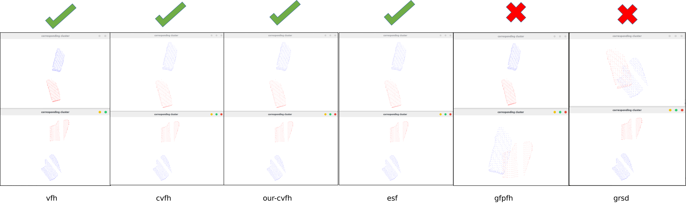
  </div>
  <figcaption><center> 图17. 不同方法在数据集1的识别效果 </center></figcaption>
</figure>

<figure>
  <div style="text-align:center;">
    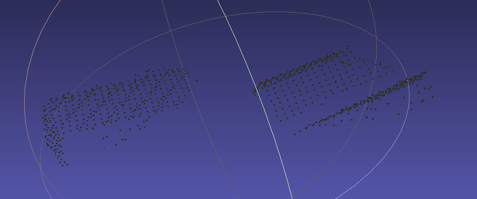
  </div>
  <figcaption><center> 图18. 不同方法在数据集2的识别效果 </center></figcaption>
</figure>

<figure>
  <div style="text-align:center;">
    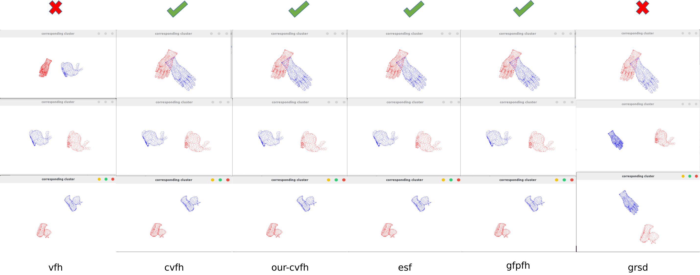
  </div>
  <figcaption><center> 图19. 不同方法在数据集3的识别效果 </center></figcaption>
</figure>

## 五. 问题与改进

- 实验测试过程中，发现估计法向量有2种方法，既可以通过K个点估计法向量(LocalMatcher::estimateNormalsByK),也可以通过邻域估计法向量(LocalMatcher::EstimateNormals)。但是实验证明，前者比后者效果更好，可视化法向量比较效果也观察不到区别。

```C++
void LocalMatcher::EstimateNormals(const PXYZS::Ptr cloud,
                                   pcl::search::KdTree<PXYZ>::Ptr kdtree,
                                   const PNS::Ptr normals, double radius) {
  pcl::NormalEstimation<PXYZ, PN> normalEstimation;
  normalEstimation.setInputCloud(cloud);
  normalEstimation.setRadiusSearch(radius);
  pcl::search::KdTree<PXYZ>::Ptr KdTree(new pcl::search::KdTree<PXYZ>);
  normalEstimation.setSearchMethod(KdTree);
  normalEstimation.compute(*normals);
  // visualize_normals(cloud, normals);
}

void LocalMatcher::EstimateNormalsByK(const PXYZS::Ptr cloud,
                                      const PNS::Ptr normals, int k) {
  pcl::NormalEstimationOMP<PXYZ, pcl::Normal> norm_est;
  norm_est.setNumberOfThreads(4);
  norm_est.setKSearch(k);
  norm_est.setInputCloud(cloud);
  norm_est.compute(*normals);
  // visualize_normals(cloud, normals);
}
```

- 针对不同的数据集和不同方法，默认参数往往不能得到最佳的效果。所以往往需要调整参数，折中平衡速度与精度。另外，目前数据集使用的点云单位为米(m)，如果有需要测试的其他数据，需要先将单位转化为米(m)。

- 匹配和识别速度与描述符数量有关。显而易见，识别只需要n个描述符（n=类别）,其识别速度大大快于匹配速度。

## 六. 总结

针对目前常用的点云描述符，本项目分析各个描述符构建原理，基于PCL库实现点云匹配和识别功能。与其他公开资料比较，该项目存在以下优势：

- 提供对应描述符的原理分析以及参数分析，指导算法调参;
- 本文的方法拿来即用，提供读取config参数文件功能，无需多次编译，方便调参匹配和识别;
- 比较各类匹配算法和识别算法的速度和精度;

但是，该项目仍然有很多需要改进的地方：

- 实验数据集较小，未来可以增加数据。进一步测试不同传感器, 不同size, 不同噪声的数据集;
- 基于描述符的点云识别无法判断错误识别，未来可以增加correspondence阈值剔除错误识别;
- 读取config的实现目前不是最简洁的，后续可以继续改进;

## 七. 参考

<div id="refer-anchor-1"></div>
- [1] [PCL/OpenNI tutorial] (https://robotica.unileon.es/index.php?title=PCL/OpenNI_tutorial_5:_3D_object_recognition_(pipeline)#Matching)

<div id="refer-anchor-2"></div>
- [2] Zhong Y. Intrinsic shape signatures: A shape descriptor for 3D object recognition[C]//2009 IEEE 12th international conference on computer vision workshops, ICCV Workshops. IEEE, 2009: 689-696.

<div id="refer-anchor-3"></div>
- [3] [点云降采样] (https://blog.csdn.net/qq_39784672/article/details/125987962)

<div id="refer-anchor-4"></div>
- [4] Frome, Andrea, et al. "Recognizing objects in range data using regional point descriptors." Computer Vision-ECCV 2004: 8th European Conference on Computer Vision, Prague, Czech Republic, May 11-14, 2004. Proceedings, Part III 8. Springer Berlin Heidelberg, 2004.

<div id="refer-anchor-5"></div>
- [5] Tombari, Federico, Samuele Salti, and Luigi Di Stefano. "Unique shape context for 3D data description." Proceedings of the ACM workshop on 3D object retrieval. 2010.

<div id="refer-anchor-6"></div>
- [6] Tombari, Federico, Samuele Salti, and Luigi Di Stefano. "Unique signatures of histograms for local surface description." Computer Vision–ECCV 2010: 11th European Conference on Computer Vision, Heraklion, Crete, Greece, September 5-11, 2010, Proceedings, Part III 11. Springer Berlin Heidelberg, 2010.

<div id="refer-anchor-7"></div>
- [7] [SHOT特征描述子](https://blog.csdn.net/weixin_42192493/article/details/105900835)

<div id="refer-anchor-8"></div>
- [8] Johnson, Andrew E., and Martial Hebert. "Using spin images for efficient object recognition in cluttered 3D scenes." IEEE Transactions on pattern analysis and machine intelligence 21.5 (1999): 433-449.

<div id="refer-anchor-9"></div>
- [9] [特征描述 Spin Image] (https://blog.csdn.net/qq_45006390/article/details/118404128)

<div id="refer-anchor-10"></div>
- [10] Guo Y, Sohel F, Bennamoun M, et al. Rotational projection statistics for 3D local surface description and object recognition[J]. International journal of computer vision, 2013, 105: 63-86.

<div id="refer-anchor-11"></div>
- [11][点云配准](https://zhuanlan.zhihu.com/p/371518695)
